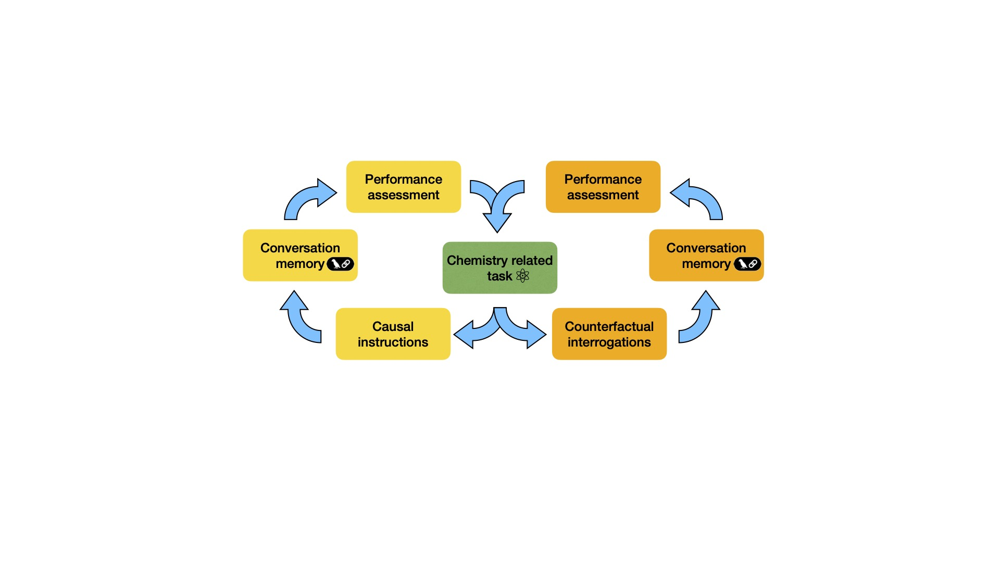
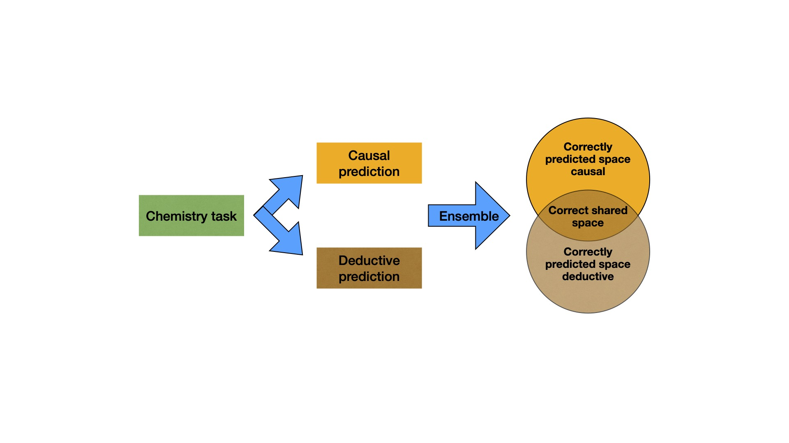
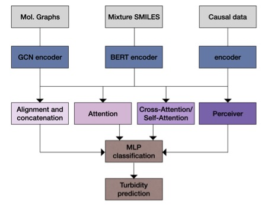

# Leveraging the resolution of Chemistry problems with Language Models and Causality

## Overview
This research investigated the possibility of improving the resolution of problems requiring chemitry logic by using causality. The experiments are separated in two main parts. First, the feasaibility of using causal reasoning to solve for chemistry problems regarding generative and classification was assessed using GPT models. In this part consisted in a causal prompting strategy, which causal instructions and causal reasoning stimulation methods were tested in the scripts "./Generative Reaction Prediction Experiment/scripts", "./Yield Experiment/scripts" and Turbidity Experiment, and "./scripts/openai_apicall_turbidity.ipynb". In a second part, the study focused on involving causal information through the use of a multi-modal model. This was designed following the results preivously obtained which suggested the need for complementary modalities to support the predictions. For this, the scripts can be found at ./scripts/multi_modal_llm_turbidity.ipynb. The findings of this research supports the incapability of GPT models to correctly conduct the resolution of problems requiring basic or high understanding of chemistry logic. It was also hypothesized that the causal reasoning of GPT models fail to improve the predictive or classficaition performances, but could be inducing a new thinking pattern and could be equiping the models with a different lens to tackle the problems. In addition to that, it was observed that multi-modal models were much better at solving the tasks, and that proving causal information could be benefiting the performances. 

## Methodology

- **For the Chemical Datasets Used**:  
  - Aldolization rection dataset: Created from Reaxys reaction dataset: https://www.elsevier.com/fr-fr/products/reaxys
  - Yield classification dataset: Obtained from Doyle's group at https://github.com/reymond-group/drfp/tree/main/data/az
  - Cage turbidity dataset: Obtained from the Jelfs' group https://zenodo.org/records/10675206
  

The research employed the following packages and workflows:

- **For Technical Analysis**:  
  - numpy: Used for numerical computations and efficient handling of multi-dimensional arrays.  
  - pandas: Used for data manipulation and analysis, including tasks such as loading datasets and cleaning data.
  - sklearn.metrics: Used for generating and analyzing confusion matrices to evaluate classification models.  
  - seaborn and matplotlib: Enhanced data visualization with accuracy, heatmap and attention plots.  
  - sklearn.decomposition (PCA): Reduced dimensionality for chemical and feature space visualization.
  - sklearn.cluster (KMeans): Used for clustering data points into groups based on feature similarity, enabling identification of patterns or natural groupings within the dataset.
  - sklearn.manifold (t-SNE): Reduced dimensionality for embeddings vizualization with respect to labels.

- **For API calls**: 
  - openai (chat-completion): Used for generating conversational AI responses by leveraging OpenAI's language models.
  - langchain: Used for building a memory buffer.

- **For Deep Learning Frameworks**:  
  - Scikit-learn Supported preprocessing, model selection, and performance evaluation.
  - Keras: Built and fine-tuned deep learning models.  
  - TensorFlow and PyTorch Implemented and trained deep learning neural networks for tie-breaking method and turbidity classification.  
  - transformers (BertTokenizer, AutoModelForSequenceClassification, AutoTokenizer, BertForSequenceClassification, Trainer, TrainingArguments): Used for tokenizing text, loading pre-trained models like ChemBERTa for SMILES reaction classification, and training models.

The workflows involved:
  - For the prompting stategy, a memory structure experiment was held with langchain while involving causality:

  

  - For the ensemble experiment, predictions involving causality and no causality were attempted to be discriminated:

  

  - For the multi-modal approach, three modalities were involved and fused using different alignment mechanims:

  

---

## Key Results
The study uncovered the following:
1. **Finding 1**: Involving causal prompts or stimulating causality in GPT models to solve for problems requiring chemical logic did not improve the resolution performance.
2. **Finding 2**: The correctly classified chemical test questions appeared to be different when involving causality and when no causality was used. 
3. **Finding 3**: Multi-modality models are far superior at solving the same problems, and it has been shown that involving causality under the form of directed acyclic graphs (DAGs) could push the performance of the model even further.

---

## Acknowledgements
This research was made possible with the support of:
- C. Shaobo, Prof. B. Faltings and Prof. P. Schwaller
- EPFL, School of Computer and Communication Sciences & Institute of Chemical Sciences and Engineering

---

